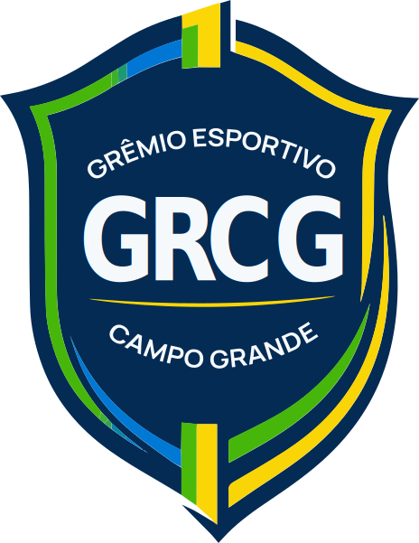
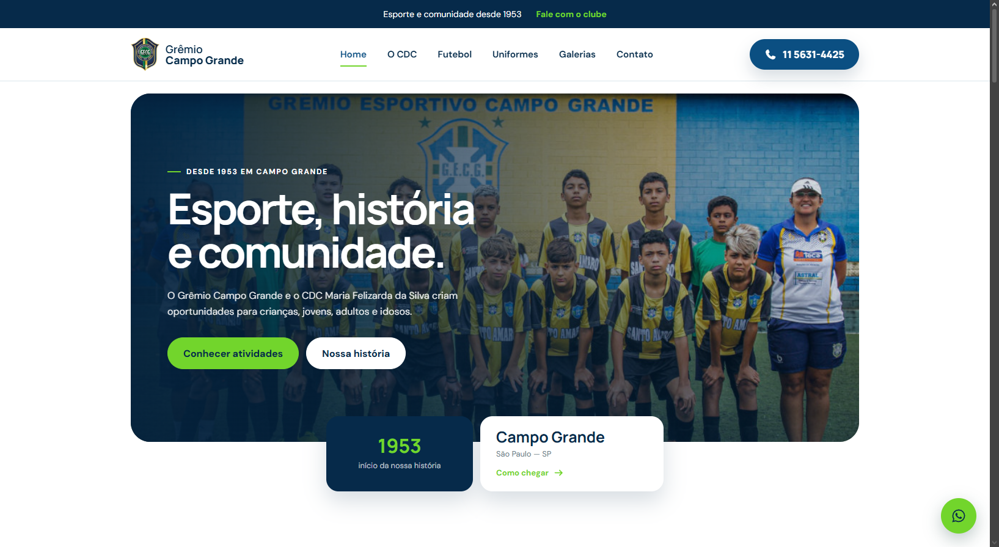
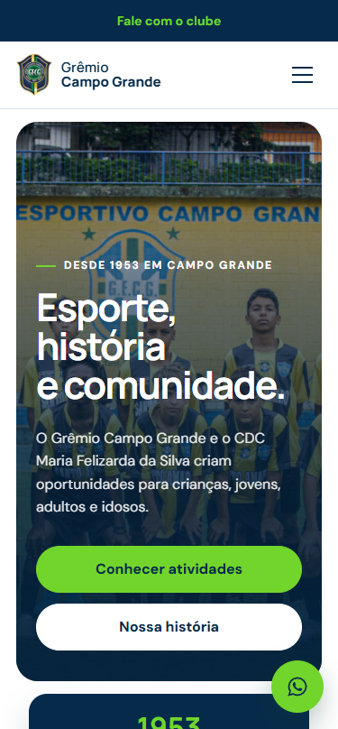

<!-- BANNER -->

  

<!-- TYPING -->

  

<!-- LINKS -->

  

---

<h2 align="center">✦ Sobre o projeto</h2>

Projeto autoral de <b>redesign completo</b> do site e da <b>identidade visual</b> do  
<b>Grêmio Esportivo Campo Grande</b>, desenvolvido por mim como proposta para o clube.   
O objetivo foi modernizar a presença digital da instituição,  
unindo <b>tecnologia, design e experiência do usuário</b> em um resultado coeso e profissional.

---

<h2 align="center">✦ O que foi desenvolvido</h2>

<table align="center">
  <tr>
    <td align="center" width="50%">
      <h3>🎨 Identidade Visual</h3>
      Logo redesenhada  
      Manual de marca  
      Paleta de cores oficial  
      Tipografia (Manrope)  
      Aplicações da marca
    </td>
    <td align="center" width="50%">
      <h3>💻 Website</h3>
      Redesign completo  
      Responsivo (mobile / tablet / desktop)  
      Estrutura reorganizada  
      Performance e HTTPS  
      Fácil de manter
    </td>
  </tr>
</table>

---

<h2 align="center">✦ Tech Stack</h2>

  

---

<h2 align="center">✦ Ferramentas de Design</h2>

  
  
  

---

<h2 align="center">✦ Destaques</h2>

✅ Design responsivo pensado mobile-first  
✅ Nova identidade aplicada de ponta a ponta  
✅ Navegação clara e conteúdo fácil de encontrar  
✅ Galerias, modalidades e contato organizados

---

<h2 align="center">✦ Preview</h2>

  <!-- Substitua pelos prints reais do site -->
  
    
  

---

<h2 align="center">✦ Sobre mim</h2>

Sou a <b>Manuela Ramos</b>, designer e desenvolvedora web.  
Estudante de Análise e Desenvolvimento de Sistemas (FIAP) e técnica em Multimídia (Senac).  
Crio experiências digitais que conectam <b>tecnologia, design e UX</b>.

---

✦ <i>Projeto desenvolvido por Manuela Ramos — 2026</i>

  

